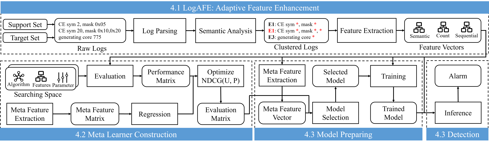

# LogCraft: Revolutionizing Unsupervised Log Anomaly Detection with Automated Machine Learning

This repository contains the code implementation for the LogCraft log anomaly detection framework. The main processes include: LogAFE, Meta Learner Construction, and Model Preparation.



## Configuration

- Ubuntu 22.04
- CUDA Version 12.2
- NVIDIA Driver Version 535.129.03
- Python 3.8

## Install

```shell
pip install -r requirements.txt
```

## Experiment

Get Sentence-Transformer

```shell
cd models
mkdir stransformer
cd stransformer
git lfs install
git clone https://huggingface.co/sentence-transformers/all-MiniLM-L6-v2
```

Implement anomaly detection on the test dataset.

```shell
cd demo
python run.py
```